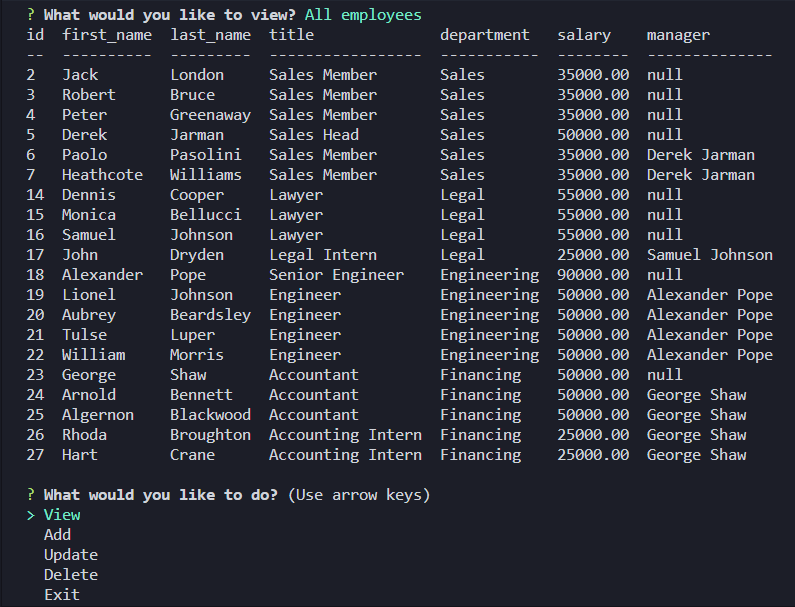

# Employee-Tracker

## Description

An application that runs on the command line and can be used to view, add, update, and remove records from a database with tables for employees, roles, and departments.

## Installation

1. Download the files
2. From the command line in the same folder as index.js run the following:
   - npm install inquirer@8.2.4
   - npm install console.table
   - npm install mysql2

## Usage

Run the application from the command line in the folder index.js is in. Run it with the command: node index.js.

## Screenshot

## Tutorial Video

<video src='./assets/imgs/employee-tracker-tutorial.mp4' width=300></video>

## Built With

- JavaScript
- SQL
- NodeJS
- Inquirer
- mysql2
- console.table

## Questions

If you have any questions, please contact at [GitHub/JonathanGibbings](https://github.com/JonathanGibbings/).
